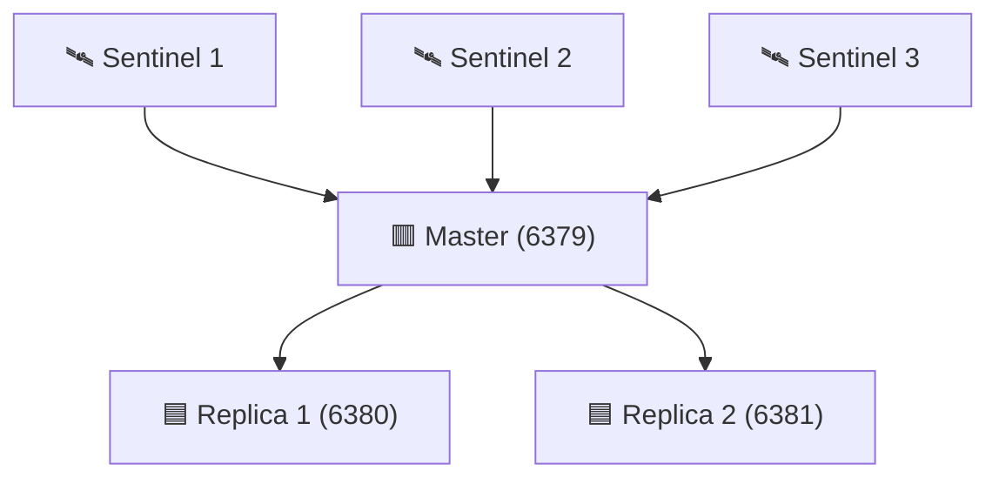
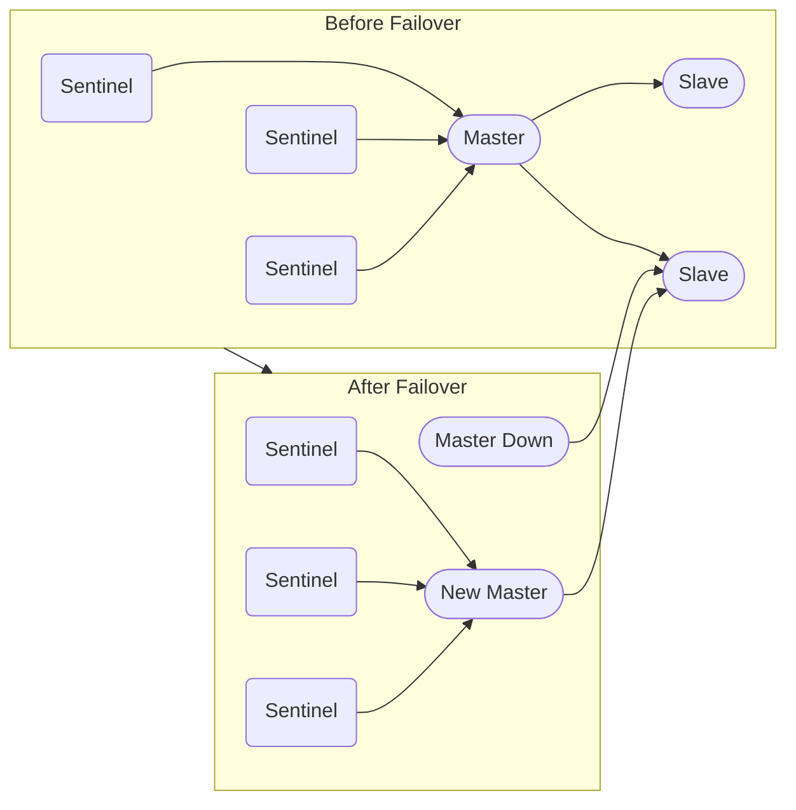
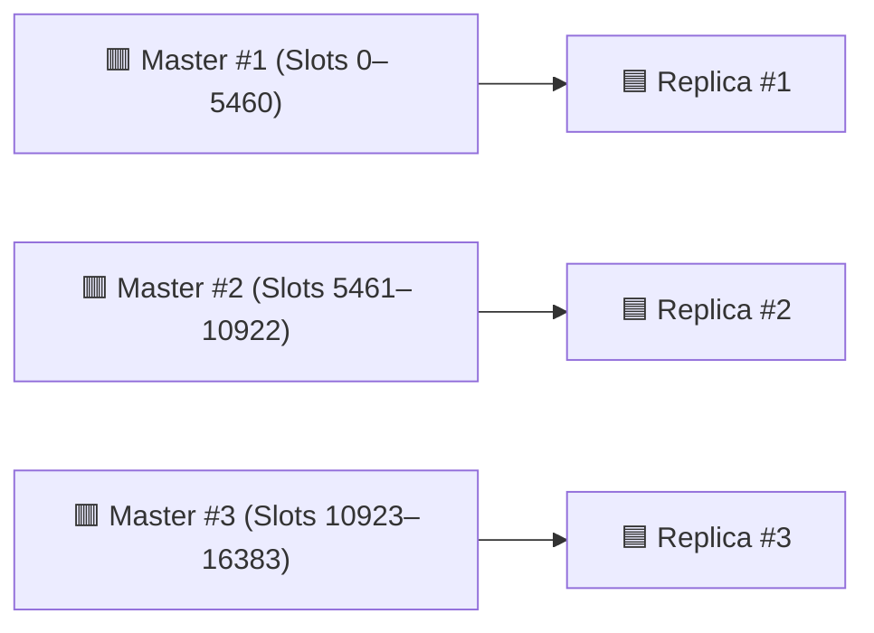

<div align="center">
  <p>
    
    <!--  -->
    <a href="https://hub.docker.com/r/thuongtruong1009/reluster" alt="Pull count">  </a>
    
    
    
    <a href="https://opensource.org/licenses/Apache-2.0" alt="License"></a>
  </p>

   

   <p>A complete, ready-to-run Redis Sentinel & Cluster playground with Docker Compose for <br/> learning, testing, and deploying Redis in real-world scenarios.</p>
</div>

## 📝 Overview

This project provides a **hands-on Redis lab** that covers both **Sentinel** and **Cluster** modes:

- ⚡ **Redis Sentinel** → High Availability & Automatic Failover
- 📦 **Redis Cluster** → Sharding + High Availability

🎯 **Goal**: Help developers, DevOps, and students **experiment, validate, monitor, and integrate Redis** into production-like environments.

## ✨ Features

- ✔ Quick Bootstrap – Start Sentinel & Cluster in seconds with Docker Compose
- ✔ Automation Scripts – Health checks, failover tests, rollback, backups, slot rebalancing, integrity, and security scan
- ✔ CI/CD Ready – GitHub Actions/GitLab CI for automated testing & deployment
- ✔ Configurable – Easily adjust number of nodes, replicas, memory limits, persistence
- ✔ Comprehensive Docs – Setup guides, architecture explanations, usage examples
- ✔ Realistic Workloads – Simulate traffic with redis-benchmark and custom scripts
- ✔ Data Persistence – RDB/AOF configurations for durability testing
- ✔ Backup & Restore – Automated backup scripts and restore procedures
- ✔ Failover Testing – Simulate node failures and observe automatic recovery
- ✔ Scaling – Add/remove nodes and reshard data with minimal downtime
- ✔ Monitoring Stack - Redis-Commander, Redis-Exporter, Prometheus, Grafana for real-time insights
- ✔ Reluster Console - Unified Cluster/Sentinel topology, metrics, safe demo data management, and controlled failover

## 🖥️ Reluster Console

Reluster Console provides one local dashboard for both Redis modes. It shows
node roles, slot coverage, Sentinel quorum, the active master, memory, clients,
throughput, and a safe `demo:*` key explorer. Redis credentials remain in the
backend and the web UI is bound to localhost by default.

Start Redis first, then the Console:

```bash
# Cluster mode
make clt
make clt-init
make console

# Or Sentinel mode
make ha
make console
```

Open <http://localhost:8080>. Key writes are limited to `demo:*`. Sentinel
failover is disabled by default; set `CONSOLE_FAILOVER_ENABLED=true` in `.env`
when you intentionally want to run that demo. See [the Console guide](apps/console/README.md)
for configuration and development details.

<!-- - ✔ Security – Basic auth, TLS setup examples -->
<!-- - ✔ Multi-Platform – Works on Linux, macOS, Windows (WSL2/Docker Desktop) -->
<!-- - ✔ Web UIs – Redis Commander, RedisInsight for easy data management & monitoring -->
<!-- - Alerts (Slack/Email/Telegram)
- ✔ Real-World Demos – Integration with Node.js, Python, Java, Go, etc. (caching, pub/sub, queues, sessions)
- ✔ Advanced Guides – Kubernetes (Helm, StatefulSet, Operator), Cloud Backup/Restore, TLS/Security -->

## 👤 Who Is This For?

- 👨‍💻 Backend Developers – Learn caching, pub/sub, queues, session storage
- 🛠️ DevOps / SREs – Practice HA, failover recovery, monitoring, scaling
- 🎓 Students / Learners – Experiment with Redis concepts in a safe sandbox
- 🏗️ System Architects – Validate Redis as a distributed system building block

## 🏗️ Architecture

### 🔹 Sentinel Mode (HA + Replica Failover)

Every Redis data node resolves the current master from Sentinel before Redis
starts. The master and replicas share one role-neutral configuration template;
the entrypoint adds `replicaof` only when the node is not the Sentinel-elected
master. Therefore, after failover, restarting the former master makes it follow
the promoted replica instead of starting a second independent master. An
already-initialized node also refuses to start standalone when all Sentinels are
unreachable, preventing an unsafe split-brain fallback.





### 🔹 Cluster Mode (Sharding + Replication)



## 🔐 Environment configuration

Reluster does not ship with runtime passwords. Create a local `.env` file before
running any Redis, Sentinel, Commander, or monitoring target:

```bash
cp .env.example .env
```

Set `REDIS_PASSWORD` to a strong random value. Set `GRAFANA_ADMIN_PASSWORD` as
well when using `make monitor`. For example, `openssl rand -hex 32` generates a
value that is safe to place in the Redis configuration templates. The `.env`
file is ignored by Git and loaded by both Docker Compose and the Makefile. Keep
`REDIS_MASTER_HOST` aligned with the master's static address in the HA network;
the provided value works with the default Compose subnet.

CI uses the `REDIS_PASSWORD` repository secret when available and creates an
isolated per-run fallback credential for untrusted pull requests.

## 🤝 Contributing

We welcome you to contribute and help improve Reluster 💚

Fork → Hack → Test → PR. Here are a few ways you can get involved:

- **🐛 Reporting Bugs:** If you come across any bugs or issues, please check out the [reporting bugs guide](https://github.com/thuongtruong109/reluster/issues) to learn how to submit a bug report.
- **✨ Suggestions:** Have ideas to enhance features? We'd love to hear them! Check out the [contribution guide](.github/CONTRIBUTING.md) to share your suggestions.
- **❓ Questions:** If you have questions or need assistance, open [discussions](https://github.com/thuongtruong109/reluster/discussions) or join our to connect with other users and contributors.

## 📝 License

Distributed under the [Apache 2.0](LICENSE) license. Copyright (c) 2025 Thuong Truong.

<!-- https://www.freecodecamp.org/news/github-super-linter/ -->
<!-- https://github.com/ChickenBenny/redis-cluster-docker -->
<!-- https://github.com/ahmed-226/redis-monitor-dashboard -->
<!-- https://medium.com/@jielim36/basic-docker-compose-and-build-a-redis-cluster-with-docker-compose-0313f063afb6 -->
<!-- https://dev.to/hedgehog/set-up-redis-diskless-replication-359 -->
